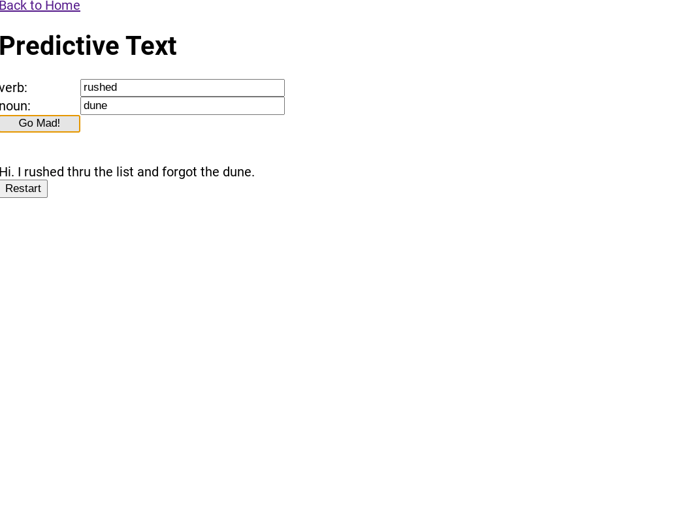

<h1 align="center">React Mad Libs</h1>

   Solution to a challenge from <a href="https://50reactprojects.com/" target="_blank">50 react projects for the static web</a>.

## Table of Contents

- [Overview](#overview)
  - [Built With](#built-with)
  - [Thoughts](#thoughts)
- [Requirements](#requirements)
- [Improvements](#improvements)
- [Useful Resources](#useful-resources)

## Overview

### Built With

- React
- React Router 

### Thoughts

- I didn't really create stories.  All you need to do is add more input boxes and add the name to state. 
- Making a story generic and flexible is the hard part of creating a mad lib. 
- I used arrays to create provide words on first run vs using a button to get a random word

- I switched gears when I explored controlling what you could type - leading to the topics of the mad-libs.  

- There is a site called madtakes that served as an inspiration.  

- Looked into reusable form component with context api by following a dev.to article
- Context api creates performance problems especially where many input fields would be re-rendered on each change.
- Have to look into useMemo and other advanced techniques and do more research

## Requirements

- [ ] Create a story template with select words replaced with text inputs that specify a category of word to add.
- [ ] Create a few more stories and the ability to save and rest the answers to each story.
- [ ] Add the ability to share a saved story with a link.

## Improvements

- Styling
- Use advanced React Router techniques ie using outlets etc. 
- Validation in forms / use a React form library

### Useful Resources

- [MadTakes](https://www.madtakes.com/) - Mad Libs site 
- [Dev.to](https://dev.to/trishathecookie/react-creating-a-reusable-form-using-react-context-5eof) - react context
- [Stack Overflow](https://stackoverflow.com/questions/56729279/redirect-to-another-component-after-submit-in-react) - redirect after submit
- [Pluralsight](https://www.pluralsight.com/guides/how-to-use-react-context-to-share-data-between-components) - context api
- [Stack Overflow](https://stackoverflow.com/questions/52398046/cant-get-input-text-boxes-and-buttons-the-same-size) - input boxes same size
- [YouTube](https://www.youtube.com/watch?v=RI8zO7l93Gc) - Vanilla JS Mad Lib Tutorial
- [W3 Schools](https://www.w3schools.com/react/react_forms.asp) - React forms
- [Qz](https://qz.com/1373489/the-scunthorpe-problem-when-regular-people-get-caught-in-the-internets-profanity-filter/) - Scunthorpe problem
- [Vice](https://www.vice.com/en/article/9kmp9v/life-on-the-internet-is-hard-when-your-last-name-is-butts) - Scunthorpe problem
- [BoredPanda](https://www.boredpanda.com/people-with-dirty-last-names-problems/?utm_source=google&utm_medium=organic&utm_campaign=organic) - dirty names
- [YourDictionary](https://examples.yourdictionary.com/examples-of-compounds.html) - compound words
- [Grammarly](https://www.grammarly.com/blog/autocorrect-text-fails/) - autocorrect fails